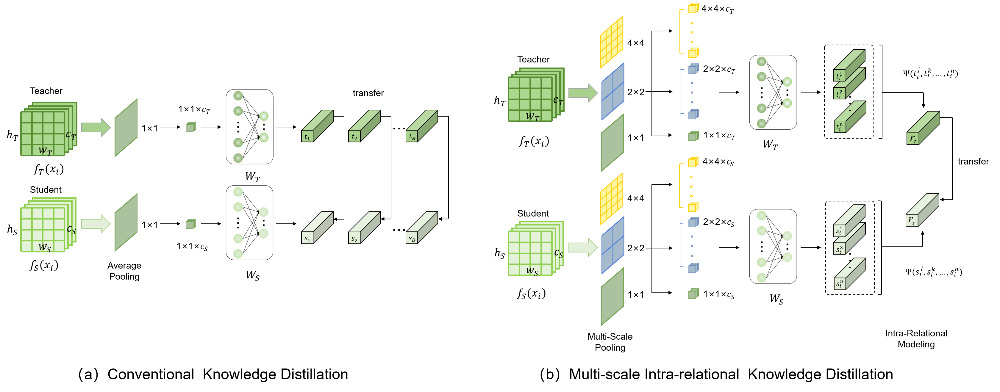

# MIRKD
Official code for the paper nemed Multiscale Intra-Relational Knowledge Distillation for Acne Grading

# Introduction
## Framework

## Installation

- Python 3.8  
- PyTorch 1.9.0  
- torchvision 0.10.0

## Training on ACNE04：
- Fetch the pretrained teacher models by:
```
python train_acne04_teacher_Densenet121.py
```
- Train student models by::
```
python train_acne04_MIRKD_KD.py
```
